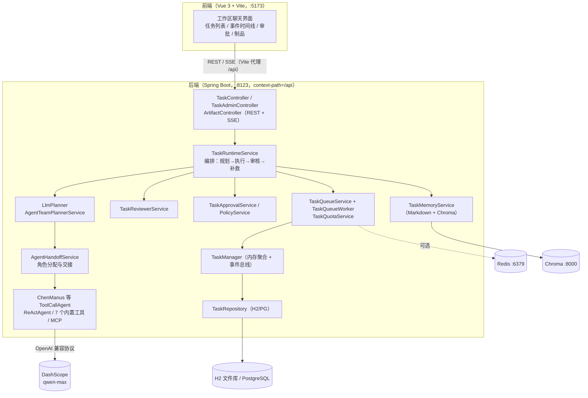
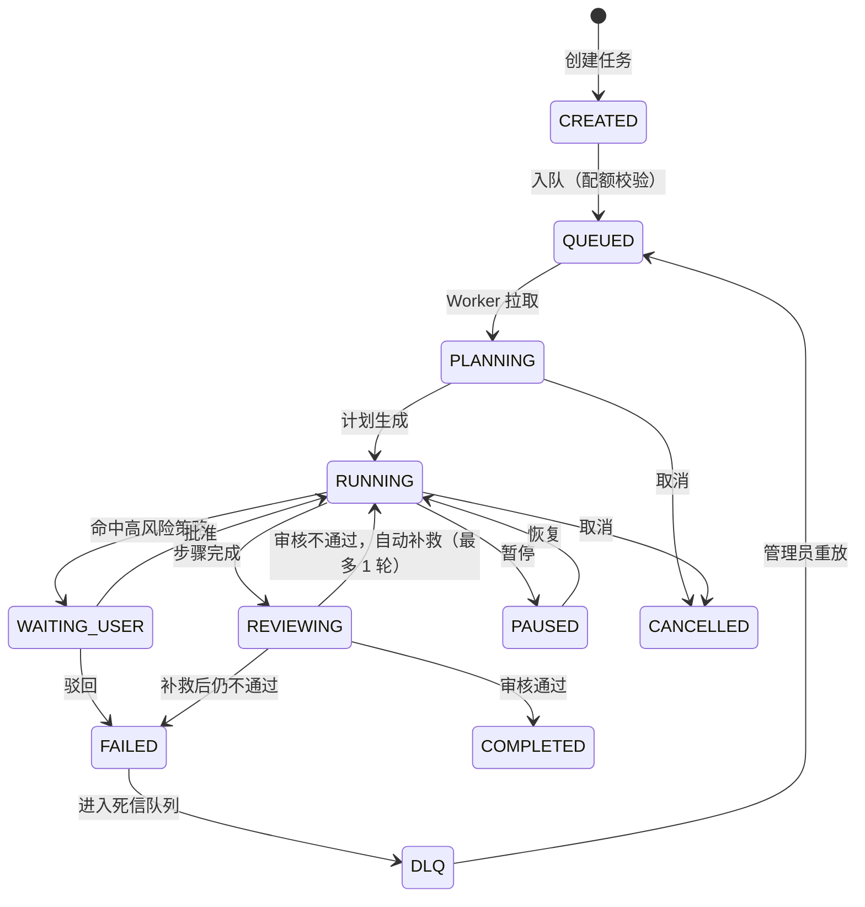

# ChenManus · AI Agent 任务系统

ChenManus 是一个基于 Spring AI 的多智能体（Multi-Agent）任务编排系统。用户用一句自然语言描述目标，系统会先规划、再调度多个专业 Agent 分工执行、自动审核与补救，并在涉及高风险操作时暂停等待人工确认；前端通过 SSE 实时展示完整执行过程。

- 后端：Spring Boot 4.1 + Spring AI 2.0（通义千问 qwen-max）
- 前端：Vue 3 + Vite + Naive UI（单工作区聊天式界面）
- 存储：H2（零配置本地）/ PostgreSQL（生产）、Chroma 向量记忆、Redis 可选（分布式锁与队列）

---

## 功能特性

- **自主规划**：LLM 将用户目标拆解为结构化步骤（Plan），支持任务暂停、恢复、取消（取消在规划阶段即时生效）。
- **多智能体协作**：按步骤类型分配 RESEARCHER / ANALYST / CODER / WRITER / GENERAL 角色，Agent 间通过 Handoff 交接。
- **工具调用**：联网搜索、网页抓取、文件操作、资源下载、终端执行、PDF 生成、任务终止；支持 MCP 扩展（高德地图、图片搜索）。
- **审核与补救**：每个任务执行后由 Reviewer 自动验收，未通过时自动补救一轮，仍不通过则进入死信队列（DLQ），可由管理员重放。
- **人工审批**：命中部署、发布、购买、支付、删除等高风险类型/关键词时，任务暂停等待批准或驳回。
- **实时事件流**：SSE 推送任务全生命周期事件，断线自动重放历史，前端按事件渲染时间线。
- **多租户与配额**：基于 tenantId / userId / sessionId 的请求身份，每租户默认最多 20 个活跃任务；支持 legacy 与 OAuth2 两种安全模式。
- **制品管理**：任务产物（PDF、下载文件等）统一登记，支持下载与预览。
- **可观测**：Actuator 健康检查（含数据库与 Chroma）、任务审计、指标（Token / 耗时 / 估算成本）。

---

## 技术栈

| 层 | 技术 | 版本 |
| --- | --- | --- |
| 语言 / 运行时 | Java | 21 |
| 后端框架 | Spring Boot | 4.1.0 |
| AI 框架 | Spring AI（OpenAI 兼容协议接入 DashScope） | 2.0.0 |
| 大模型 / Embedding | 通义千问 qwen-max / text-embedding-v3 | dashscope-sdk 2.22.27 |
| 数据库 | H2（本地默认）/ PostgreSQL（生产） | 随 Spring Boot |
| 向量库 | Chroma | 1.x（HTTP API） |
| 缓存 / 队列 | Redis（可选，分布式锁与队列） | - |
| 工具 | Hutool、SpringDoc OpenAPI、Kryo、iText | 5.8.46 / 3.1.1 等 |
| 前端 | Vue 3、Vite 4、TypeScript、Naive UI、Pinia、Tailwind CSS | Vue 3.2 / Vite 4 |
| 部署 | Docker、docker-compose | - |

---

## 整体架构

### 组件视图



### 任务生命周期



### 后端核心包

| 包 / 类 | 职责 |
| --- | --- |
| `controller/TaskController` | 任务 CRUD、暂停/恢复/取消、批准/驳回、SSE 事件流、历史事件、配额查询 |
| `controller/TaskAdminController` | 死信队列查看与重放（需管理员令牌） |
| `controller/ArtifactController` | 任务制品下载与预览 |
| `task/TaskRuntimeService` | 核心编排：规划、执行、审核、补救、取消的状态机 |
| `task/TaskQueueService` / `TaskQueueWorker` | 任务队列、250ms 轮询调度、并发控制（默认 4） |
| `task/TaskManager` | 任务聚合根的内存缓存、事件持久化与 SSE 监听器管理（坏监听器自动隔离） |
| `task/TaskRepository` | H2/PostgreSQL 持久化（`schema.sql` 自动建表） |
| `task/LlmPlanner`（`planner` 包） | 调用 LLM 生成计划与步骤 |
| `task/AgentTeamPlannerService` / `AgentHandoffService` | 步骤角色分配与 Agent 交接 |
| `task/TaskReviewerService` | Reviewer 审核与补救决策 |
| `task/TaskApprovalService` / `TaskApprovalPolicyService` | 高风险操作审批门禁与策略 |
| `task/TaskMemoryService` | 任务记忆：本地 Markdown 摘要 + Chroma 向量检索（best-effort） |
| `task/TaskMetricsService` | Token、耗时、模型调用次数与估算成本 |
| `task/TaskQuotaService` | 租户活跃任务配额（默认 20） |
| `agent/ChenManus` | 通用 ToolCallAgent（继承 `ToolCallAgent` / `ReActAgent` / `BaseAgent`） |
| `tools/` | 7 个内置工具与统一注册（`ToolRegistration`） |
| `config/` | CORS、MVC、OAuth2 安全配置、身份拦截器 |

### 内置工具

| 工具 | 说明 | 依赖 |
| --- | --- | --- |
| WebSearchTool | 联网搜索（searchapi.io） | 环境变量 `SEARCH_API_KEY`（未配置则不可用） |
| WebScrapingTool | 网页内容抓取 | 无 |
| FileOperationTool | 工作目录内文件读写 | 无 |
| ResourceDownloadTool | 网络资源下载 | 无 |
| TerminalOperationTool | 终端命令执行 | 无（受审批策略约束） |
| PDFGenerationTool | 生成 PDF 制品 | 无 |
| TerminateTool | 任务主动终止 | 无 |

MCP 扩展默认不启用；在 `mcp-servers.json` 中配置后可接入高德地图、图片搜索等 stdio MCP 服务。

---

## 目录结构

```
chen-ai-agent/
├── src/main/java/io/github/chenyouxin8/chenaiagent/
│   ├── advisor/          # ChatClient 日志 Advisor
│   ├── agent/            # BaseAgent / ReActAgent / ToolCallAgent / ChenManus
│   ├── common/           # 统一响应、业务异常、全局异常处理
│   ├── config/           # CORS、安全、MVC 配置
│   ├── constant/         # 常量
│   ├── controller/       # REST + SSE 控制器
│   ├── planner/          # LLM 计划模型（Plan / PlanStep / LlmPlanner）
│   ├── task/             # 任务编排核心（状态机、队列、审批、审核、记忆、配额…）
│   └── tools/            # 内置工具与注册
├── src/main/resources/
│   ├── application.yml                  # 主配置（环境变量占位）
│   ├── application-local.example.yml    # 本地开发配置模板
│   ├── application-oauth2.yml           # OAuth2 生产 profile
│   ├── mcp-servers.example.json         # MCP 服务配置模板
│   └── schema.sql                       # 数据库建表脚本
├── src/test/            # 单元测试（真实 LLM 集成测试 ChenManusTest 默认排除）
├── chen-ai-agent-frontend/             # Vue 3 前端
│   └── src/
│       ├── api/tasks.ts                # 任务接口与 SSE 封装
│       ├── views/workspace/index.vue   # 工作区主界面
│       ├── views/shell/                # 侧边栏与外壳
│       ├── components/common/          # NaiveProvider / SvgIcon / 设置弹窗
│       ├── router/、store/、locales/、styles/
├── docker-compose.yml
├── Dockerfile / Dockerfile.frontend
└── start-local.cmd       # Windows 本地一键启动后端（需按本机改 JAVA_HOME）
```

---

## 本地运行

### 前置要求

- **JDK 21**（必须，项目使用 Java 21）
- **Node.js 18+**（开发环境使用 Node 22 验证）
- **ChromaDB**（向量记忆，需本地启动；未启动时应用仍可运行，向量记忆降级）
  ```bash
  pip install chromadb
  chroma run --host 127.0.0.1 --port 8000 --path ./.chroma
  ```
- **通义千问 API Key**（DashScope，OpenAI 兼容模式）

### 1. 准备后端配置

```bash
# 复制本地配置模板（application-local.yml 已被 .gitignore 忽略）
cp src/main/resources/application-local.example.yml src/main/resources/application-local.yml
```

在 `application-local.yml` 中填入 Key，或直接设置环境变量（推荐，不用改文件）：

```bash
# Windows PowerShell
$env:AI_DASHSCOPE_API_KEY = "sk-你的DashScope Key"
# 可选：联网搜索
$env:SEARCH_API_KEY = "你的 searchapi.io Key"
```

> 主配置 `application.yml` 中所有密钥均为环境变量占位，未配置时应用使用占位值启动（仅保证冒烟测试可用，真实任务必须配置有效 Key）。

### 2. 启动 Chroma（终端 1）

```bash
chroma run --host 127.0.0.1 --port 8000 --path ./.chroma
```

### 3. 启动后端（终端 2，仓库根目录）

```bash
# Windows
.\mvnw.cmd spring-boot:run "-Dspring-boot.run.arguments=--spring.profiles.active=local"

# macOS / Linux
./mvnw spring-boot:run -Dspring-boot.run.arguments=--spring.profiles.active=local
```

后端启动后：

- 健康检查：http://127.0.0.1:8123/api/actuator/health
- 接口文档：http://127.0.0.1:8123/api/swagger-ui.html
- 数据默认存于 H2 文件库 `./data/chenmanus-db.mv.db`，任务记忆在 `./data/task-memory/`

Windows 也可直接修改并运行 `start-local.cmd`（将其中的 `JAVA_HOME` 改成本机 JDK 21 路径）。

### 4. 启动前端（终端 3）

```bash
cd chen-ai-agent-frontend
npm install
npm run dev
```

打开 Vite 输出的地址（默认 http://127.0.0.1:5173），进入「工作区」即可创建任务。前端开发服务器会把 `/api` 代理到 `http://localhost:8123`（见 `vite.config.ts` 与前端 `.env`）。

### 可选：启用 MCP 服务

```bash
cp src/main/resources/mcp-servers.example.json src/main/resources/mcp-servers.json
# 填入高德 / Pexels Key，并在 application-local.yml 中取消 mcp client 三行注释
```

### 可选：启用 Redis（分布式锁 / 队列）

```bash
# docker-compose up -d redis，然后设置
$env:CHENMANUS_REDIS_ENABLED = "true"
```

未启用 Redis 时使用单机内存锁与内存队列，适合本地开发。

---

## 主要配置项

| 环境变量 | 默认值 | 说明 |
| --- | --- | --- |
| `AI_DASHSCOPE_API_KEY` | 占位值 | 通义千问 API Key（真实任务必填） |
| `SEARCH_API_KEY` | 占位值 | searchapi.io 联网搜索 Key |
| `DATABASE_URL` | `jdbc:h2:file:./data/chenmanus-db;...` | 数据库连接，生产可换 PostgreSQL |
| `REDIS_URL` | `redis://127.0.0.1:6379` | Redis 地址（需配合 `CHENMANUS_REDIS_ENABLED=true`） |
| `CHENMANUS_REDIS_ENABLED` | `false` | 是否启用 Redis 锁与队列 |
| `CHENMANUS_SECURITY_MODE` | `legacy` | 安全模式：`legacy` / `oauth2` |
| `CHENMANUS_LEGACY_ADMIN_TOKEN` | 空 | legacy 模式下管理接口（DLQ）的 X-Admin-Token |
| `API_KEY` | 空 | legacy 模式全局 Bearer Token（空则不鉴权） |
| `CHENMANUS_OIDC_ISSUER_URI` / `CHENMANUS_OIDC_AUDIENCE` | 空 | OAuth2 模式的 OIDC 发行方与受众 |
| `CHENMANUS_APPROVAL_ENABLED` | `true` | 是否启用高风险操作审批 |
| `CHENMANUS_APPROVAL_REQUIRED_TYPES` | `DEPLOY,PURCHASE,PAYMENT` | 需要审批的步骤类型 |
| `CHENMANUS_APPROVAL_REQUIRED_KEYWORDS` | 发布/部署/支付/删除等 | 触发审批的关键词（中英文） |
| `CHENMANUS_MAX_PARALLEL_STEPS` | `4` | 单任务并行步骤上限 |
| `CHENMANUS_MAX_ACTIVE_TASKS_PER_TENANT` | `20` | 每租户活跃任务配额 |
| `CHENMANUS_QUEUE_POLL_MS` | `250` | 队列轮询间隔 |
| `CHENMANUS_ARTIFACT_ALLOWED_ROOT` | `./data` | 制品允许访问的根目录（防目录穿越） |

> 完整配置见 `src/main/resources/application.yml`。

---

## HTTP API 概览

所有接口前缀为 `/api`，统一返回 `{ code, message, data, time }`。

| 方法 | 路径 | 说明 |
| --- | --- | --- |
| POST | `/tasks` | 创建任务（prompt、tenantId、userId、sessionId、priority） |
| GET | `/tasks` | 查询任务列表（按身份范围过滤） |
| GET | `/tasks/quota` | 查询当前租户配额与活跃任务数 |
| GET | `/tasks/{taskId}` | 任务详情（含步骤、指标） |
| POST | `/tasks/{taskId}/pause` / `/resume` / `/cancel` | 暂停 / 恢复 / 取消 |
| POST | `/tasks/{taskId}/approve` / `/reject` | 高风险步骤批准 / 驳回 |
| GET | `/tasks/{taskId}/events` | SSE 实时事件流（`text/event-stream`） |
| GET | `/tasks/{taskId}/events/history` | 历史事件（断线重放） |
| GET | `/tasks/{taskId}/artifacts/{artifactId}/download` | 下载制品 |
| GET | `/tasks/{taskId}/artifacts/{artifactId}/preview` | 预览制品 |
| GET | `/tasks/admin/dlq` | 死信队列列表（管理员） |
| POST | `/tasks/admin/dlq/replay` | 重放死信任务（管理员） |

---

## 测试

```bash
# 全部单元测试（自动排除需要真实 LLM 的 ChenManusTest）
.\mvnw.cmd test "-Dtest=!ChenManusTest"

# 前端类型检查与构建
cd chen-ai-agent-frontend
npm run type-check
npm run build
```

`ChenManusTest` 是真实调用大模型的集成测试（local profile），需要有效 Key，默认不纳入常规测试。

---

## Docker 部署

- `docker-compose up -d`：启动 PostgreSQL、Redis、Chroma、后端与前端（生产构建）。
- 仅后端：`docker build -t chen-ai-agent .`
- 仅前端：`docker build -f Dockerfile.frontend -t chen-ai-agent-frontend ./chen-ai-agent-frontend`
- 生产环境使用 `--spring.profiles.active=oauth2` 并配置 OIDC 发行方、受众与 `CHENMANUS_LEGACY_ADMIN_TOKEN`。

生产建议：关闭 Swagger（`springdoc.api-docs.enabled=false`）、启用 HTTPS、配置外部 PostgreSQL 与 Redis、通过环境变量注入所有密钥。

---

## 安全与多租户

- 每个请求携带 `tenantId` / `userId` / `sessionId`（`X-Tenant-Id` 等请求头或查询参数），任务、事件、制品均按身份隔离。
- **legacy 模式**：可选全局 Bearer Token（`API_KEY`）；管理接口需 `X-Admin-Token`（`CHENMANUS_LEGACY_ADMIN_TOKEN`）。
- **oauth2 模式**：Spring Security 资源服务器校验 JWT，按角色限制管理接口。
- 制品访问限制在 `CHENMANUS_ARTIFACT_ALLOWED_ROOT` 内，防止路径穿越。
- 终端执行、发布、购买、支付等动作受审批策略约束，必须人工确认。

---

## 开源协议

[MIT](LICENSE)。本项目免费开源，没有任何形式的付费行为。
